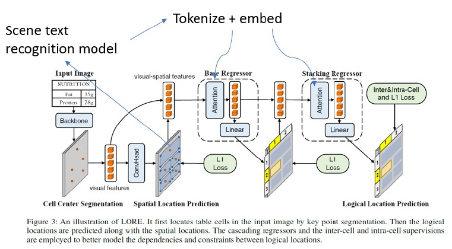

# LORE-TSR modified

PyTorch implementation of a modified LORE-TSR. LORE can perform table structure recognition (TSR) in the end-to-end way by modeling TSR as logical location regression. The model streamlines the TSR pipeline as a key-point based detector-like framework. LORE-TSR exhibits good efficiency and performance in the implemention, which could be useful for TSR models in the future.

The original model can be found at [AlibabaResearch's repository](https://github.com/AlibabaResearch/AdvancedLiterateMachinery.git) 

Modifications can be seen in the image below.




## 1 Installation
### 1.1 Installing Requirements

```
conda create --name Lore python=3.7
conda activate Lore
pip install -r requirements.txt
```

### 1.2 Installing Cocoapi
```
git clone https://github.com/cocodataset/cocoapi.git
cd cocoapi/PythonAPI
pip install Cython
make
python setup.py install --user
```

### 1.3 Installing DCNv2 from Scratch
If you would like to using the DLA backbone, an environment based on CUDA 10.1 is strongly recommended.
#### 1.3.1 Installing CUDA
Firstly, CUDA 10.1 (FROM https://developer.nvidia.com/cuda-toolkit-archive) should be installed. Take an example of Linux-x86_64-Ubuntu-18.04:
```
wget https://developer.download.nvidia.com/compute/cuda/10.1/Prod/local_installers/cuda_10.1.243_418.87.00_linux.run
sudo sh cuda_10.1.243_418.87.00_linux.run

#Setting env variables
export CUDA_HOME='your cuda-10.1 path'
export LD_LIBRARY_PATH=$CUDA_HOME/lib64:$LD_LIBRARY_PATH
```
#### 1.3.2 Installing Torch
```
pip install torch==1.6.0+cu101 -f https://download.pytorch.org/whl/torch_stable.html
```

#### 1.3.3 Installing DCNv2
Install DCNv2 with the [DCNv2-repo](https://github.com/lucasjinreal/DCNv2_latest.git)

## 2.Run Demo with Pretrained Model


### 2.1 Pretrained Models 

Available model weights (using dla-34 backbone):

| Name | Backbone | Regressor Arc | Image Size | Checkpoint | 
| :---:| :---:| :---: | :---: | :---: |
|ckpt_wtw| DLA-34 | 4+4 | 1024 |[Trained on WTW](https://drive.google.com/file/d/1n33c9jmGmjSfRbheleE1pqiIXBb_BCEw/view?usp=sharing)|
|ckpt_ptn| DLA-34 | 3+3 | 512 | [Trained on PubTabNet](https://drive.google.com/file/d/1hg5R42u_6xaoO-6Ft18Ctu86HB_N2Bzu/view?usp=sharing)|
|ckpt_wireless| ResNet-18 | 4+4 | 768 | [Trained on Wireless Tables](https://drive.google.com/file/d/1cBaewRwlZF1tIZovT49HpJZ5wlb3nSCw/view?usp=sharing)*|

*This model is pretrained on a combination of SciTSR, PubTabNet and a set of Chinese tables. Remember to add `--upper_left` when running demo with this model, since it is trained on a different image preprocess pipeline.  

Another implementation with pretrained checkpoint will be released at [ModelScope](https://www.modelscope.cn/models/damo/cv_resnet-transformer_table-structure-recognition_lore/summary), which is more convenient for inference and application.

### 2.2 Running Demo
Following the steps to run LORE on wireless table images:
1. Download pretrained model in `ckpt_wireless`
2. Add image files to test into `./input_imgs/wireless/`
3. Change the parameters such as model architecture, model path and input/output directory
3. Run the scripts

```
cd src
bash scripts/infer/demo_wireless.sh
```

Following the steps to run LORE on wired table images:
1. Download pretrained model in `ckpt_wtw`
2. Add image files to test into `./input_imgs/wired/`
3. Change the parameters such as model architecture, model path and input/output directory
3. Run the scripts
```
cd src
bash scripts/infer/demo_wired.sh
```
NOTICE: 
LORE is incorporated with the parsing-and-grouping mechenism similar to Cycle-CenterNet for wired tables. Setting `--wiz_rev` arguments to activate such process at inference stage. It provides accurate detection results on wired tables, but could slow the inference.

## 3 Trainning

### 3.1 Preparing Dataset

The labels are supposed to be transformed into COCO format, here the WTW dataset and a subset of PubTabNet dataset are taken as examples. The directory of dataset are organized as following:

```
data
├── WTW
│   ├── images
│   └── json
│       ├──train.json
│       └──test.json
│
└── PTN
    ├── images
    └── json
        ├── train.json
        └── test.json
```    
We provide samples of COCO-like labels for WTW ([COCO label link](https://drive.google.com/file/d/1Ad7NOnaLpn-uxIyotOebslF4CxqcoU0R/view?usp=sharing)) and a subset of PubTabNet ([COCO label link](https://drive.google.com/file/d/1xQ3t5Bg739rNz9AFAMmV7zLhvmTZ_E1n/view?usp=sharing)).

Images of WTW dataset are at [WTW-Dataset](https://github.com/wangwen-whu/WTW-Dataset). It provide the original dataset along with tools for changing it into COCO format. Images of PubTabNet dataset are at [PubTabNet-Dataset](https://github.com/ibm-aur-nlp/PubTabNet).

### 3.2 Training Scripts

Following the steps to train LORE on wireless table images:
1. Organizing the dataset as mentioned before and put the label set at `LORE-TSR/data/dataset_name/json/`
2. Changing the parameters such as model architecture, dataset name and image directory etc.
3. Run:
```
cd src
bash scripts/train/train_wireless.sh
```


Use the following command to train LORE on WTW dataset:
```
cd src
bash scripts/train/train_wired.sh
```

*We modified the original model to stabilize converging and make it easier to change backbone, by removing the learning weight in Eq. 2 and gathering the feature of cell centers from a conv-head.

## 4 Testing
Taking the PubTabNet as an example:
1. Setting dataset name `--dataset_name` and annotation path `--anno_path` to the demo scripts 
2. Run demo on the test dataset:
```
cd src
bash scripts/demo/demo_test.sh
```
3. Evaluating the result of model (remeber to change the directory of model results)
```
bash eval.sh
```

## Acknowledgements
This implementation has been based on the repository [CenterNet](https://github.com/xingyizhou/CenterNet) and [DCNv2](https://github.com/jinfagang/DCNv2_latest).

## Paper
* [Arxiv](https://arxiv.org/abs/2303.03730)

## Citation
If you find this work useful, please cite:

LORE:
```
@article{Xing_2023_Lore,
  author={Hangdi, Xing and Feiyu Gao and Rujiao Long and Jiajun Bu and Qi Zheng and Liangcheng Li and Cong Yao and Zhi Yu},
  title={LORE: Logical Location Regression Network for Table Structure Recognition},
  journal={arXiv preprint arXiv:2303.03730},
  year={2023}
}
```
Cycle-CenterNet:
```
@InProceedings{Long_2021_ICCV,
	author = {Rujiao, Long and Wen, Wang and Nan, Xue and Feiyu, Gao and Zhibo, Yang and Yongpan, Wang and Gui-Song, Xia},
	title = {Parsing Table Structures in the Wild},
	booktitle = {Proceedings of the IEEE/CVF International Conference on Computer Vision (ICCV)},
	month = {October},
	year = {2021}
}

```

## *License*

LORE-TSR is released under the terms of the [Apache License, Version 2.0](LICENSE).

```
LORE-TSR is an algorithm for table structure recognition and the code and models herein created by the authors from Alibaba can only be used for research purpose.
Copyright (C) 1999-2023 Alibaba Group Holding Ltd. 

Licensed under the Apache License, Version 2.0 (the "License");
you may not use this file except in compliance with the License.
You may obtain a copy of the License at

    http://www.apache.org/licenses/LICENSE-2.0

Unless required by applicable law or agreed to in writing, software
distributed under the License is distributed on an "AS IS" BASIS,
WITHOUT WARRANTIES OR CONDITIONS OF ANY KIND, either express or implied.
See the License for the specific language governing permissions and
limitations under the License.
```